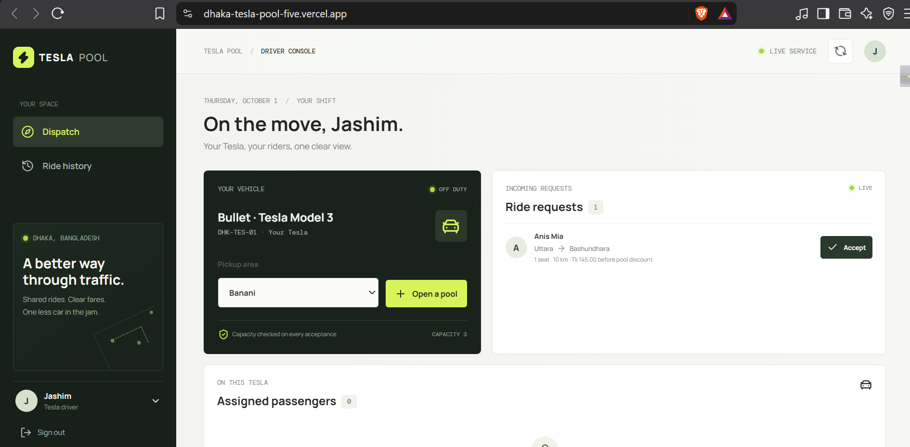
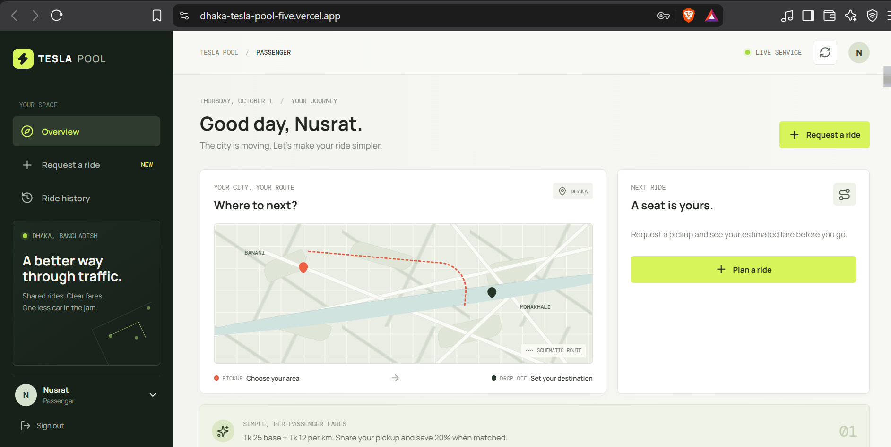
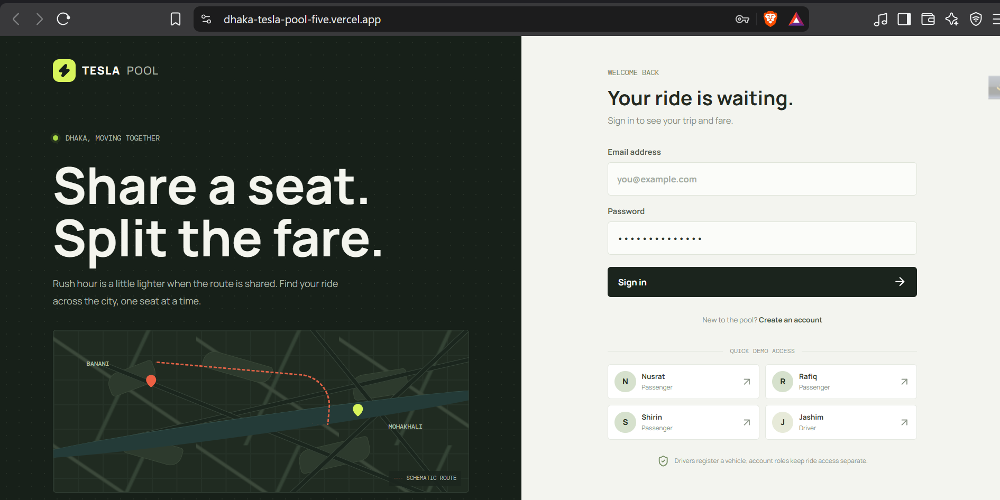
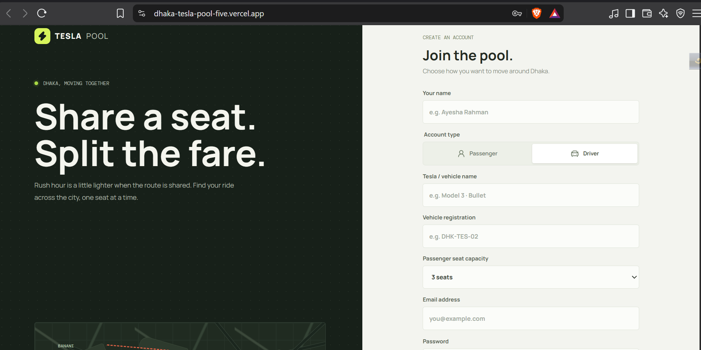
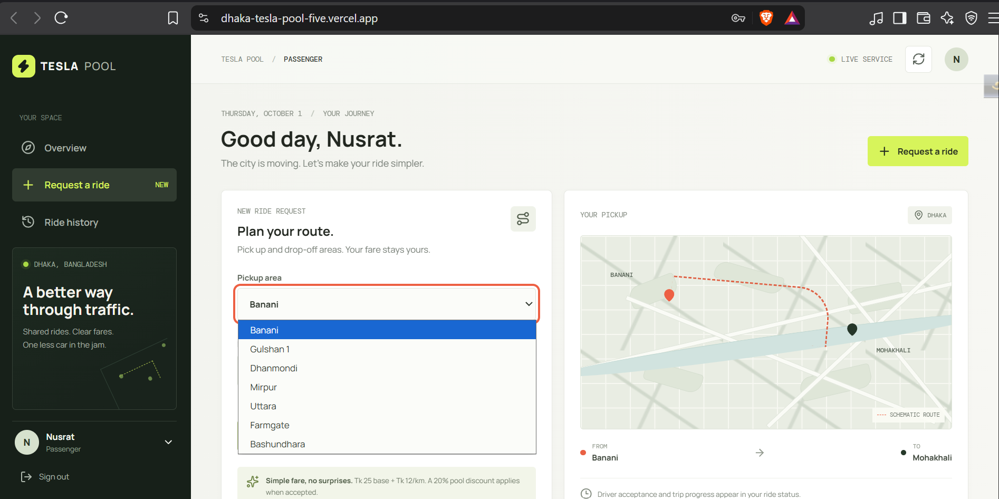
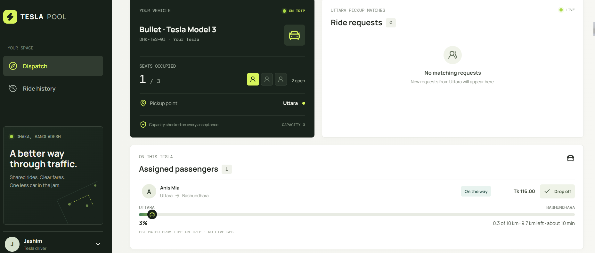
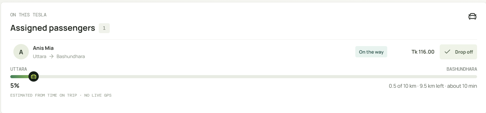
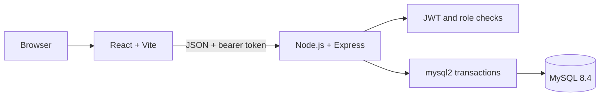
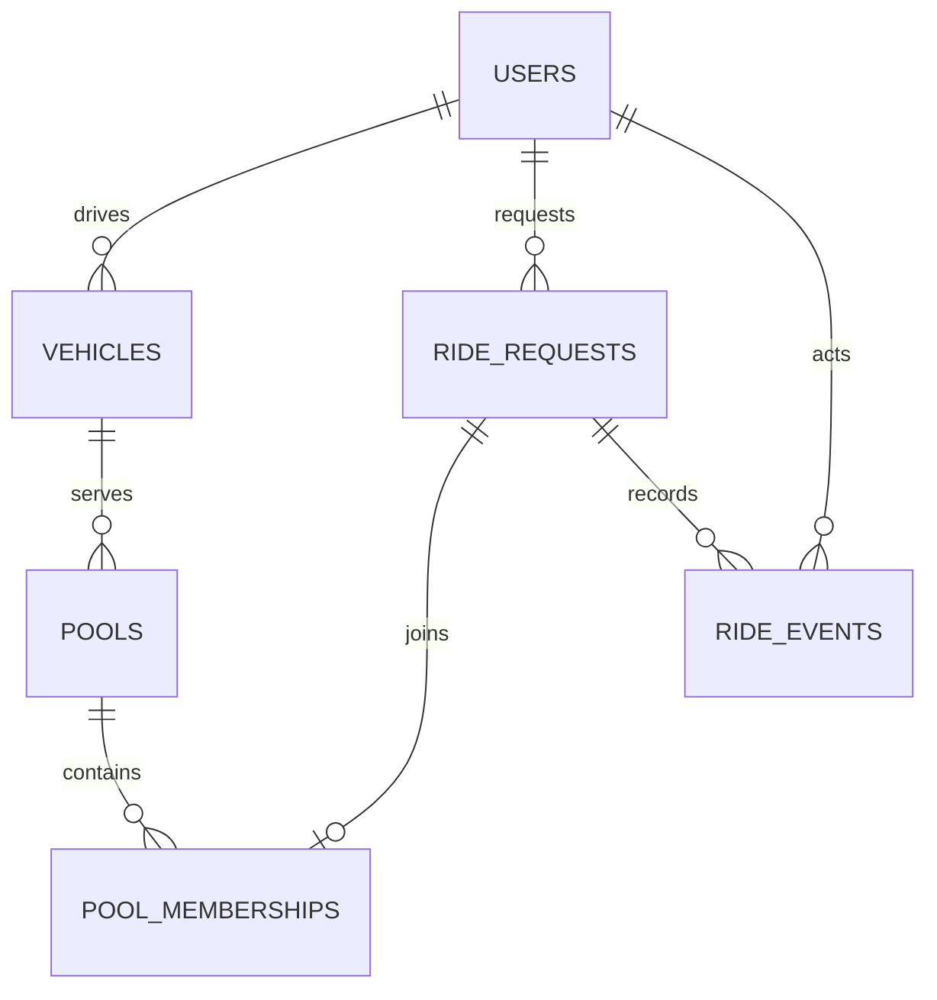

# Dhaka Tesla Pool

**Share a seat. Split the fare. Survive Dhaka traffic.** A ride-pooling MVP built around Jashim's three-seat Tesla, Bullet, and passenger journeys for Nusrat, Rafiq and Shirin.

## What it does

- Passengers and drivers can register. Passenger signup enables ride requests; driver signup requires a vehicle name, registration and seat capacity, and creates the user plus vehicle atomically. Both roles can sign in to their separate dashboards.
- Passengers request a ride between Dhaka areas, choose up to three seats, see their own fare and status, cancel eligible rides, and inspect an event receipt.
- Drivers open a pickup-zone pool, review compatible requests, accept only when capacity permits, and record arrival, start and completion.
- Current ride state and audit history are stored in MySQL. Seed data matches Nusrat and Rafiq to Jashim's Bullet, leaving exactly one of its three seats available for Shirin.
- The React UI refreshes every 15 seconds. It does not depend on paid maps or payment services.

## Run with Docker

Prerequisites: Docker Desktop with Compose and free local ports `5173` (web) and `4000` (API).

```powershell
Copy-Item .env.example .env
```

Replace the sample `MYSQL_PASSWORD`, `MYSQL_ROOT_PASSWORD` and `JWT_SECRET` values in `.env`, then run:

```powershell
docker compose up --build -d
```

- Web app: https://dhaka-tesla-pool-five.vercel.app/
- API health: https://dhaka-tesla-pool-t5xd.onrender.com/health
- Demo Video: https://drive.google.com/file/d/1ZRw-clJGBJBs8mpmMjjWBf88l8HbyxcT/view?usp=sharing
- Logs: `docker compose logs -f api`
- Stop: `docker compose down`
- Stop and delete the local database: `docker compose down -v`

## 📸 Visuals(interfaces and overview) of Site

### Dashboard



### Login


### SignUp



### Ride/trip





Change `WEB_PORT` or `API_HOST_PORT` in `.env` if those host ports are in use. MySQL is only exposed on the Compose network. On first start the API applies the schema and idempotently seeds the demo accounts.

## Demo accounts

All demo accounts use the local-only password `TeslaPool@2026`.

| Person | Role | Email |
| --- | --- | --- |
| Jashim | Driver | `jashim@teslapool.bd` |
| Nusrat | Passenger | `nusrat@teslapool.bd` |
| Rafiq | Passenger | `rafiq@teslapool.bd` |
| Shirin | Passenger | `shirin@teslapool.bd` |

Two seats start occupied. Sign in as Shirin and request a Banani pickup; then sign in as Jashim in another browser session and accept it. A further request that exceeds capacity is rejected by the API, including under concurrent accepts.

## Local development

Copy `.env.example` to `.env`, set the local-only values, and start MySQL 8.4 locally. In two terminals:

```powershell
npm install
npm run dev
```

```powershell
npm --prefix backend install
npm run dev:api
```

Vite proxies `/api` to `http://localhost:4000`. Set `DB_HOST`, `DB_PORT`, `DB_NAME`, `DB_USER`, `DB_PASSWORD` and `JWT_SECRET`; API startup applies the migration and seed.

## Tests and quality checks

```powershell
npm run lint
npm run build
npm test
```

The normal suite covers fare arithmetic, route distance, pickup compatibility and lifecycle transitions. The MySQL contention test is opt-in; start the stack first, then run:

```powershell
docker compose run --rm -e RUN_DB_TESTS=1 api npm run test:integration
```

The test creates disposable records, races two one-seat requests for a one-seat vehicle, expects one success and one HTTP 409, verifies occupancy and removes its rows.

## Fare and matching assumptions

Money uses integer poisha (`100 poisha = Tk 1`):

```text
distance = Manhattan distance between documented area-grid coordinates (km)
base fare = 2,500 poisha
distance charge = distance_km × 1,200 poisha
pool fare = round((base fare + distance charge) × 0.80)
```

Banani → Mohakhali is 3 km: Tk 61.00 before matching and Tk 48.80 pooled. Banani → Gulshan 1 is 5 km: Tk 85.00 before matching and Tk 68.00 pooled. Each passenger has their own route, seats and fare; no shared total is divided. The grid is a hand-checkable approximation, not real Dhaka routing. Matching requires the exact same pickup zone; destinations can differ. See [the fare model](docs/fare-model.md).

Ride lifecycle: `REQUESTED → MATCHED → DRIVER_ARRIVED → STARTED → COMPLETED`; cancellation is allowed only before `STARTED`. Driver actions must follow the next legal state. Each transition and its audit event are committed together.

## Architecture and data model





See [architecture/schema](docs/architecture.md) and [capacity/concurrency notes](docs/concurrency.md).

## API overview

| Method | Path | Purpose |
| --- | --- | --- |
| `POST` | `/api/auth/register` | Create a passenger or driver account; driver requests include vehicle details |
| `POST` | `/api/auth/login` | Sign in and receive an 8-hour JWT |
| `GET` | `/api/dashboard` | Return caller-scoped passenger rides or driver dispatch |
| `POST` | `/api/rides` | Create a validated ride request |
| `POST` | `/api/rides/pool` | Open the driver's pickup-zone pool |
| `POST` | `/api/rides/:id/accept` | Accept a compatible request if capacity allows |
| `POST` | `/api/rides/:id/arrive` | Record driver arrival |
| `POST` | `/api/rides/:id/start` | Start a ride |
| `POST` | `/api/rides/:id/complete` | Complete a ride |
| `POST` | `/api/rides/:id/cancel` | Cancel the passenger's eligible ride |
| `GET` | `/api/rides/:id` | Read an authorized ride and event timeline |
| `GET` | `/health` | Check API and database readiness |

## Technology choices

- React + Vite keeps this authenticated single-page MVP quick to build; SSR adds little value here.
- Express 5 and REST fit the small actor set. Zod validates requests at the API boundary.
- MySQL 8.4 is the requested relational store. Direct parameterized `mysql2` queries make the row-locking capacity transaction inspectable without an ORM.
- JWT + bcryptjs keep sign-in self-contained. The demo stores its bearer token in local storage; production should use secure HttpOnly cookies and refresh-token rotation.
- Docker Compose + Nginx builds the static React app and API next to a private MySQL service. No paid cloud service is required.
- Node's built-in test runner covers pure domain rules and an opt-in real-MySQL concurrency case.

## Integrity, security and failure behavior

All accepts for one vehicle lock the vehicle row in a MySQL transaction, then check active membership seats. Ride state, pooled fare, membership and audit event commit atomically or roll back. Completed and cancelled rides stop counting toward capacity. A full pool returns HTTP 409.

Passwords are hashed; SQL values are parameterized; inputs are validated; Helmet headers and auth rate limits are enabled. Passenger reads/actions are scoped to that passenger; driver updates are scoped to rides assigned to that driver's vehicle. Invalid transitions return 409, role violations 403 and unknown/non-owned rides 404. Logs redact authorization headers. If MySQL is unavailable, the API health check fails and Compose waits for DB health before starting the API.

The vehicle row lock serializes only contention for that Tesla. At higher load, measure lock wait, add idempotency keys and bounded retries, partition dispatch across vehicle rows, and use metrics/tracing. Keep capacity authoritative in the database; queues and caches must not become the seat source of truth. Redis, brokers, geospatial search and live push are deliberately out of scope.

## AI use and submission notes

GitHub Copilot was used to extract the PRD, scaffold the app, and draft code and docs. The accepted suggestion to serialize acceptance on the vehicle row is implemented and covered by the opt-in MySQL race test. The nearby reference project used PostgreSQL; this implementation uses the requested MySQL instead. Review the code and be ready to explain each decision.

No public deployment URL or six-minute demo recording is included; those require an account/recording destination and are not fabricated. The Docker deployment is reproducible locally. The PRD also asks for meaningful commits and `master`, `pre-release`, `release/v1.0.0`; no branches or commits were created in this workspace. Establish that incremental history before assessment submission.

## Deploy on Render + Vercel

See the [deployment guide](docs/deployment.md) for the Blueprint, Vercel environment settings, TLS, CORS and external MySQL requirements. A Git-connected repository, provider accounts and a reachable MySQL 8.0+ database are needed before creating live services.

## Known limits and next steps

- Static area-grid distance and exact-pickup matching replace maps and road routing.
- No wallet/payment gateway, ratings, driver marketplace or live push updates.
- One active pool per vehicle and one active ride per passenger are enforced in application logic.
- Add migration version tracking, idempotency keys, production session handling, driver/vehicle administration and a free public deployment if available.
- Record the requested six-minute video and add its link before submission.
