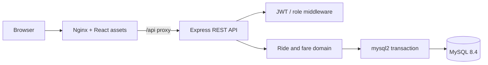
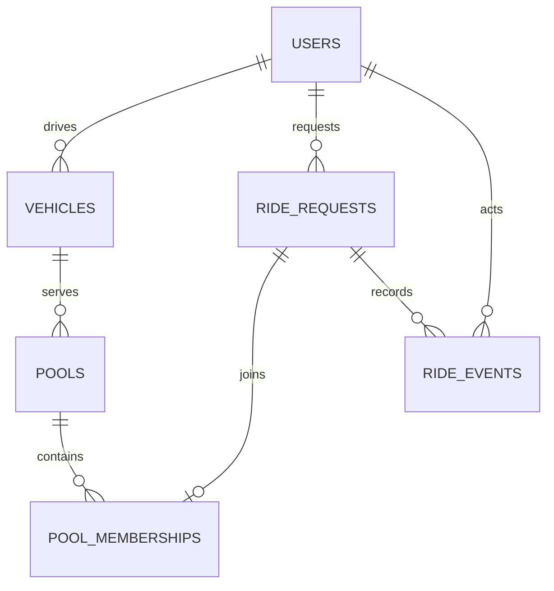

# Architecture and Schema

The browser serves a Vite-built React single-page app from Nginx. Nginx forwards `/api` to one Express API. The API owns authentication, validation, fare calculation, lifecycle transitions and seat reservation. MySQL is the source of truth for users, vehicles, pools, memberships, ride states and audit events.

## Relationships

| Table | Purpose | Integrity notes |
| --- | --- | --- |
| `users` | Passenger and driver identity | Unique email, role enum, password hashes only |
| `vehicles` | Driver-owned Tesla and capacity | Capacity check from 1 to 8, unique plate, driver foreign key |
| `pools` | Pickup-zone dispatch session for a vehicle | Status and pickup indexes; active-pool uniqueness is enforced under a vehicle lock |
| `ride_requests` | One passenger's route, seats, individual fare and current state | Passenger foreign key, distinct-zone and seat checks, indexed matching lookup |
| `pool_memberships` | Connect an accepted request to its pool | Unique ride foreign key; inserted inside capacity transaction |
| `ride_events` | Append-only explanation of ride state changes | Ride/actor foreign keys and ordered per-ride index |

Seats count as occupied while a member ride is `MATCHED`, `DRIVER_ARRIVED` or `STARTED`. Completed and cancelled rides release seats without deleting membership history.

## Request flow

1. The API validates route and seats, calculates the distance and undiscounted estimate, then writes a `REQUESTED` ride and its first event.
2. Acceptance locks the driver's vehicle row, then the request and compatible open pool.
3. The API sums active membership seats. Only when `occupied + requested <= capacity` does it update ride status/fare, insert membership and append the `MATCHED` event before committing.
4. Driver lifecycle changes and passenger cancellation update the ride and append an event in one transaction.

## Errors and operations

Invalid inputs return 400, role violations 403, missing/non-owned rides 404, and full pools or illegal transitions 409. Passenger or driver signup writes identity and (for drivers) the required vehicle in one transaction. Unexpected failures return a generic 500 message while structured logs retain the error. `/health` checks MySQL as well as API liveness. Compose waits for MySQL before API startup and API health before web startup.

Dashboard data refreshes every 15 seconds instead of using websockets. This suits a two-session demo; production dispatch should add authenticated push updates and a retryable outbox/event design.